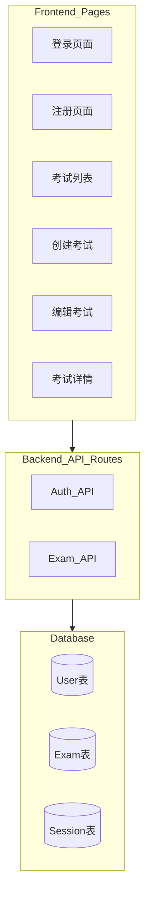
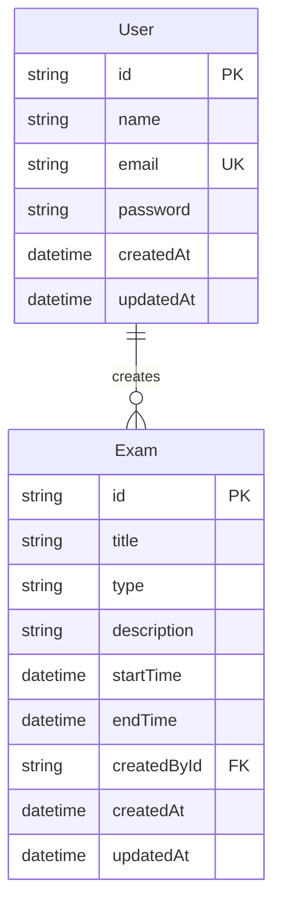

# CET 考试系统 MVP 实施计划

## 项目架构



## 数据模型



## 实施步骤

### 第一阶段：项目初始化

1. **创建 Next.js 项目**

   - 使用 `pnpm create next-app@latest` 创建项目
   - 配置 TypeScript、Tailwind CSS、App Router

2. **安装核心依赖**
   ```bash
   pnpm add prisma @prisma/client
   pnpm add next-auth@beta bcryptjs
   pnpm add react-hook-form @hookform/resolvers zod
   pnpm add sonner lucide-react
   pnpm add -D @types/bcryptjs
   ```

3. **配置 Shadcn UI**

   - 初始化 Shadcn UI：`pnpm dlx shadcn@latest init`
   - 添加需要的组件：button, form, input, card, table, dialog, toast

### 第二阶段：数据库设置

1. **配置 Prisma**

   - 创建 [`prisma/schema.prisma`](prisma/schema.prisma)
   - 定义 User 和 Exam 模型
   - 配置 Vercel Postgres 连接

2. **环境变量配置**

   - 创建 [`.env.local`](.env.local)
   - 配置 `DATABASE_URL`、`NEXTAUTH_SECRET`、`NEXTAUTH_URL`

3. **数据库迁移**
   ```bash
   pnpm prisma generate
   pnpm prisma db push
   ```


### 第三阶段：认证系统

1. **配置 NextAuth.js**

   - 创建 [`app/api/auth/[...nextauth]/route.ts`](app/api/auth/[...nextauth]/route.ts)
   - 实现 Credentials Provider
   - 配置 session 策略

2. **注册功能**

   - 创建 API: [`app/api/auth/register/route.ts`](app/api/auth/register/route.ts)
   - 创建页面: [`app/(auth)/register/page.tsx`](app/\\(auth)/register/page.tsx)
   - 使用 React Hook Form + Zod 验证

3. **登录功能**

   - 创建页面: [`app/(auth)/login/page.tsx`](app/\\(auth)/login/page.tsx)
   - 集成 NextAuth signIn

### 第四阶段：考试管理功能

1. **考试 API 路由**

   - GET [`app/api/exams/route.ts`](app/api/exams/route.ts) - 获取考试列表
   - POST [`app/api/exams/route.ts`](app/api/exams/route.ts) - 创建考试
   - GET [`app/api/exams/[id]/route.ts`](app/api/exams/[id]/route.ts) - 获取考试详情
   - PUT [`app/api/exams/[id]/route.ts`](app/api/exams/[id]/route.ts) - 更新考试
   - DELETE [`app/api/exams/[id]/route.ts`](app/api/exams/[id]/route.ts) - 删除考试

2. **考试管理页面**

   - [`app/dashboard/page.tsx`](app/dashboard/page.tsx) - 考试列表（使用 Table 组件）
   - [`app/dashboard/exams/create/page.tsx`](app/dashboard/exams/create/page.tsx) - 创建考试表单
   - [`app/dashboard/exams/[id]/edit/page.tsx`](app/dashboard/exams/[id]/edit/page.tsx) - 编辑考试表单
   - [`app/dashboard/exams/[id]/page.tsx`](app/dashboard/exams/[id]/page.tsx) - 考试详情

3. **表单验证 Schema**

   - 创建 [`lib/validations/exam.ts`](lib/validations/exam.ts)
   - 定义 Zod schema

### 第五阶段：UI 和用户体验

1. **布局组件**

   - [`app/dashboard/layout.tsx`](app/dashboard/layout.tsx) - 主布局（带导航栏）
   - 添加退出登录功能

2. **通用组件**

   - 考试卡片组件
   - 删除确认对话框
   - Loading 状态

3. **Toast 提示**

   - 集成 Sonner
   - 在操作成功/失败时显示提示

## 关键文件说明

### Prisma Schema 示例

```prisma
model User {
  id        String   @id @default(cuid())
  name      String
  email     String   @unique
  password  String
  exams     Exam[]
  createdAt DateTime @default(now())
  updatedAt DateTime @updatedAt
}

model Exam {
  id          String   @id @default(cuid())
  title       String
  type        String   // CET4, CET6
  description String?  @db.Text
  startTime   DateTime
  endTime     DateTime
  createdBy   User     @relation(fields: [createdById], references: [id])
  createdById String
  createdAt   DateTime @default(now())
  updatedAt   DateTime @updatedAt
}
```

### 环境变量

需要在 `.env.local` 中配置：

- `DATABASE_URL`: Vercel Postgres 连接字符串
- `NEXTAUTH_SECRET`: 随机生成的密钥
- `NEXTAUTH_URL`: 应用 URL（开发环境为 http://localhost:3000）

## 技术要点

- 使用 App Router 的 Server Actions 处理表单提交
- 使用 NextAuth 的 `getServerSession` 保护 API 路由
- 使用 Prisma Client 的类型安全查询
- 使用 React Hook Form + Zod 实现客户端和服务端双重验证
- 使用 Lucide React 图标库
- 使用 Shadcn UI 的 Form 组件简化表单开发

## 预期成果

完成后将拥有：

- 完整的用户认证系统（注册/登录/退出）
- 考试管理界面（列表、创建、编辑、删除、详情查看）
- 响应式设计，支持移动端
- 可直接部署到 Vercel 的生产环境